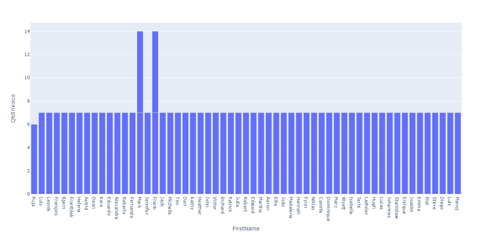
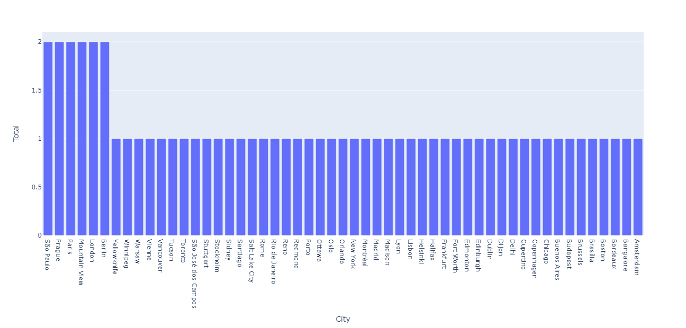

# Resolução do projeto

Banco de dados utilizado - DBeaver Sample Database **(SQLite)**

# Etapa 1: Extraction

**Objetivo:** Extrair os dados necessários para responder as perguntas de uma análise diagnóstica.

**Ferramentas usadas nesta etapa:**

 

~~~SQL
-- Quais dos clientes são colaboradores?
SELECT c.FirstName FROM Customer c 
	WHERE c.Company IS NOT NULL AND c.FirstName
		IN (SELECT e.FirstName FROM Employee e);
~~~

> **Resposta:**
> Nenhum dos colaboradores são clientes.

---

~~~SQL
-- Quantos clientes possuem invoice associados e a quantidade por cada um
SELECT c.FirstName, c.CustomerId, COUNT(*) AS QtdInvoice FROM Invoice i
	INNER JOIN Customer c ON c.CustomerId  = i.CustomerId 
		GROUP BY 2 ORDER BY QtdInvoice;
~~~

> **Resposta:**

|FirstName|CustomerId|QtdInvoice|
|---------|----------|----------|
|Puja|59|6|
|Luís|1|7|
|Leonie|2|7|
|François|3|7|
|Bjørn|4|7|
|František|5|7|
|Helena|6|7|
|Astrid|7|7|
|Daan|8|7|
|Kara|9|7|
|Eduardo|10|7|
|Alexandre|11|7|
|Roberto|12|7|
|Fernanda|13|7|
|Mark|14|7|
|Jennifer|15|7|
|Frank|16|7|
|Jack|17|7|
|Michelle|18|7|
|Tim|19|7|
|Dan|20|7|
|Kathy|21|7|
|Heather|22|7|
|John|23|7|
|Frank|24|7|
|Victor|25|7|
|Richard|26|7|
|Patrick|27|7|
|Julia|28|7|
|Robert|29|7|
|Edward|30|7|
|Martha|31|7|
|Aaron|32|7|
|Ellie|33|7|
|João|34|7|
|Madalena|35|7|
|Hannah|36|7|
|Fynn|37|7|
|Niklas|38|7|
|Camille|39|7|
|Dominique|40|7|
|Marc|41|7|
|Wyatt|42|7|
|Isabelle|43|7|
|Terhi|44|7|
|Ladislav|45|7|
|Hugh|46|7|
|Lucas|47|7|
|Johannes|48|7|
|Stanisław|49|7|
|Enrique|50|7|
|Joakim|51|7|
|Emma|52|7|
|Phil|53|7|
|Steve|54|7|
|Mark|55|7|
|Diego|56|7|
|Luis|57|7|
|Manoj|58|7|

---

~~~SQL
-- Quantidade de clientes por cidade que constam na base de dados
SELECT City, COUNT(*) AS Total FROM Customer c
    GROUP BY 1 ORDER BY Total DESC ;

~~~

> **Resposta:**

|City|Total|
|----|-----|
|São Paulo|2|
|Prague|2|
|Paris|2|
|Mountain View|2|
|London|2|
|Berlin|2|
|Yellowknife|1|
|Winnipeg|1|
|Warsaw|1|
|Vienne|1|
|Vancouver|1|
|Tucson|1|
|Toronto|1|
|São José dos Campos|1|
|Stuttgart|1|
|Stockholm|1|
|Sidney|1|
|Santiago|1|
|Salt Lake City|1|
|Rome|1|
|Rio de Janeiro|1|
|Reno|1|
|Redmond|1|
|Porto|1|
|Ottawa|1|
|Oslo|1|
|Orlando|1|
|New York|1|
|Montréal|1|
|Madrid|1|
|Madison|1|
|Lyon|1|
|Lisbon|1|
|Helsinki|1|
|Halifax|1|
|Frankfurt|1|
|Fort Worth|1|
|Edmonton|1|
|Edinburgh |1|
|Dublin|1|
|Dijon|1|
|Delhi|1|
|Cupertino|1|
|Copenhagen|1|
|Chicago|1|
|Buenos Aires|1|
|Budapest|1|
|Brussels|1|
|Brasília|1|
|Boston|1|
|Bordeaux|1|
|Bangalore|1|
|Amsterdam|1|

---

# Etapa 2 - Transform

**Objetivo:** Usar os dados extraídos do database e expressá-los de forma gráfica usando Python.

**Ferramentas usadas nesta etapa:**

 

~~~Python
# Quantos clientes possuem invoice associados e a quantidade por cada um
import pandas as pd
import plotly.express as px

CustomerInv = pd.read_csv('_Quantos_clientes_possuem_invoice_associados_e_a_quantidade_por__202309251515.csv')

grafico = px.bar(CustomerInv, x='FirstName', y='QtdInvoice')
grafico.show()
~~~

> **Resposta:**

---

~~~Python
# Quantidade de clientes por endereço que constam na base de dados
import pandas as pd
import plotly.express as px

CustomerCity = pd.read_csv('_Quantidade_de_clientes_por_endereço_que_constam_na_base_de_dado_202309251515.csv')

grafico2 = px.bar(CustomerCity, x='City' , y='Total')
grafico2.show()
~~~

> **Resposta:**

---

# Etapa 3 - Load

**Objetivo:** Disponibilizar toda a resolução do projeto em um repositório no GitHub.

**Ferramentas usadas nesta etapa:**

 

---

# Considerações finais

Muito obrigado por ver meu projeto completo, ficou bastante simples mas é apenas como objeto de estudo de **Ciência de dados com Python.**

Fique a vontade para me seguir aqui no GitHub e acompanhar meus projetos, aceito críticas construtivas e ensinos.

Até mais!
### Jesus te Ama!

